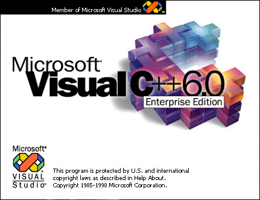

# Visual C++ 6.0 over Docker with CMake Integration

Have you ever needed to build some C++ code for an old version of Windows using Visual C++ 6.0 from 1998? No? Well anyways here's a working toolchain on a Docker container for it. Now with proper CMake integration!



## Using it

### Traditional Approach

```bash
# Starts a Windows CMD
docker run --rm -it -v $(pwd):/prj giulioz/vc6-docker

# On SELinux systems (like Fedora, RHEL, CentOS), use the :Z volume flag
# docker run --rm -it -v $(pwd):/prj:Z giulioz/vc6-docker

# Inside the CMD...
cd z:\prj

# Now you can use the compiler!
cd example
cl test.cpp /IZ:\opt\vc\include /GX /link /LIBPATH:Z:\opt\vc\LIB
test # Hello world!
```

You can also use a Makefile:

```bash
# While in the example folder...
nmake
test # Hello world!
```

### CMake Integration (New!)

We now provide a CMake integration that allows you to build VC6 projects using standard CMake commands on Linux/macOS:

```bash
# Run the Docker container
docker run --rm -it -v $(pwd):/work giulioz/vc6-docker

# Inside the container, you can build a CMake project using:
/opt/vc/build_cnc.sh /work/your-project

# Or try the included example project:
cd /opt/vc/example
./build.sh
./build/run.sh
```

### Getting the includes

When working with your editor of choice (like VS Code) you may need to configure the include path for the suggestions. Since the files are inside the container, you can use the following command to copy them in your machine.

```bash
docker run --rm -v $(pwd):/prj giulioz/vc6-docker bash /opt/vc/copy_includes.sh

# On SELinux systems (like Fedora, RHEL, CentOS), use the :Z volume flag
# docker run --rm -v $(pwd):/prj:Z giulioz/vc6-docker bash /opt/vc/copy_includes.sh
```

## Building it

The Docker image is now self-contained and runs on any platform without the need for platform flags during `docker run`. It uses a multi-stage build approach where the final image is always x86_64/amd64 regardless of the build platform.

### Standard Build

```bash
# Standard build with layer caching
docker build . --tag giulioz/vc6-docker
```

### Caching Downloads

The Dockerfile is designed to cache the Visual C++ 6.0 download using Docker's layer caching mechanism. The download layer depends on the `download-options` file and an optional `cache-marker.txt` file, so it will be cached as long as these files don't change.

If you want to use a mirror or different download location, you can modify the `download-options` file:

```bash
# Example: Edit the download-options file to use a different URL
echo "VC6_DOWNLOAD_URL=https://your-mirror.example.com/vc6.7z" > download-options

# Then build as normal
docker build . --tag giulioz/vc6-docker
```

To force a re-download of the VC++ package, you can:

```bash
# Method 1: Force a clean build without using any cache
docker build --no-cache . -t giulioz/vc6-docker

# Method 2: Update the cache marker to invalidate just the download layer
echo "v2" > cache-marker.txt
```

The `cache-marker.txt` file provides a way to invalidate just the download cache without affecting other build layers, which is useful when you need to re-download the package but don't want to rebuild everything from scratch.

### Distribution

To distribute the image in a registry:

```bash
# Build and push to a registry
docker build . -t giulioz/vc6-docker
docker push giulioz/vc6-docker
```

The container will run the same way on any platform (ARM/M1/M2 Macs, x86_64 Linux/Windows) without any special flags or configuration.

## CMake Integration Details

### How It Works

The CMake integration uses Python proxy scripts to act as translators between CMake and Visual C++ 6.0:

1. **Path Translation**: The proxy scripts convert between Linux/macOS paths and Windows paths.

2. **CMake Integration**: The toolchain file (`vc6-toolchain.cmake`) configures CMake to use our proxy scripts as the compiler and linker.

3. **Wine Execution**: The proxy scripts execute the Visual C++ 6.0 compiler and linker through Wine.

4. **Error Handling**: The proxy scripts capture the compiler/linker output and return the appropriate exit codes.

### Core Components

- `tools/winetools.py`: Core utility functions for path translation and Wine execution
- `tools/cl.py`: Proxy for the C/C++ compiler (CL.EXE)
- `tools/link.py`: Proxy for the linker (LINK.EXE)
- `tools/midl.py`: Proxy for the IDL compiler (MIDL.EXE)
- `vc6-toolchain.cmake`: CMake toolchain file

### Using in Your Projects

To use the CMake integration in your own projects:

1. Create a `CMakeLists.txt` file for your project.
2. Configure CMake to use the VC6 toolchain file.
3. Build with CMake's standard commands.

Example `CMakeLists.txt`:

```cmake
cmake_minimum_required(VERSION 3.12)
project(MyProject)

# Add your source files
add_executable(my_app
    src/main.cpp
    src/utils.cpp
)

# Add include directories
target_include_directories(my_app PRIVATE include)

# Optional: Add IDL files
target_idl_files(my_app
    src/my_interface.idl
)
```

Then build with:

```bash
# Configure with the VC6 toolchain
cmake -DCMAKE_TOOLCHAIN_FILE=/opt/vc/vc6-toolchain.cmake -B build

# Build
cmake --build build
```

### Example Project

Check out the `example` directory for a complete sample project that demonstrates:

- Basic C++ code compilation
- IDL file compilation
- CMake configuration
- Build and run scripts
